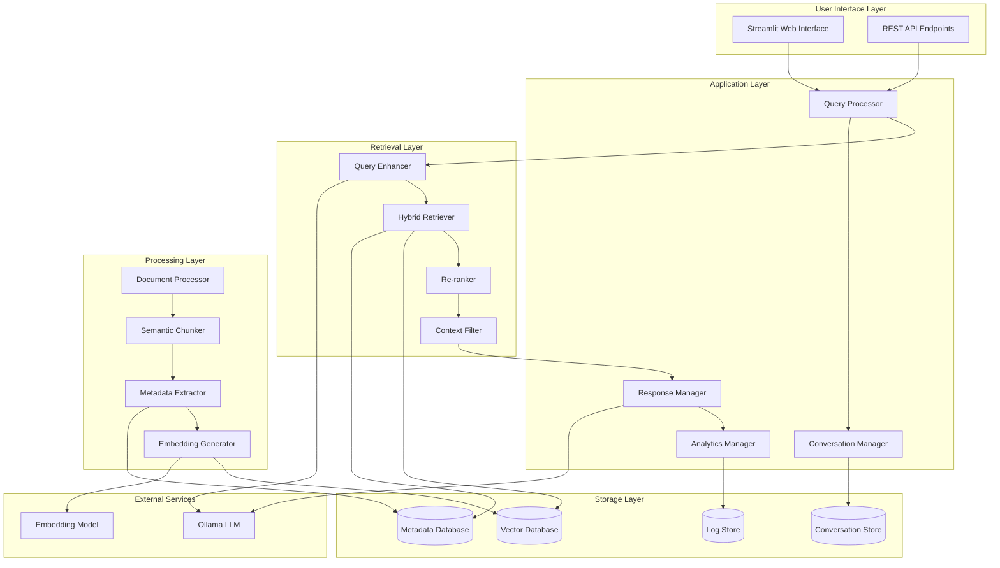

# Design Document

## Overview

This design document outlines the architecture for enhancing the existing RAG-based educational assistant system. The improvements focus on creating a more sophisticated, reliable, and user-friendly system that can better serve Smart ICT students at INPT. The design addresses current limitations in document processing, retrieval accuracy, conversation management, and overall system reliability.

The enhanced system will maintain the existing Streamlit interface while significantly improving the backend processing pipeline, introducing advanced retrieval mechanisms, and adding conversation memory capabilities.

## Architecture

### High-Level Architecture



### Component Architecture

The system follows a layered architecture with clear separation of concerns:

1. **User Interface Layer**: Handles user interactions and API endpoints
2. **Application Layer**: Core business logic and orchestration
3. **Retrieval Layer**: Advanced search and ranking capabilities
4. **Processing Layer**: Document ingestion and preparation
5. **Storage Layer**: Persistent data management

## Components and Interfaces

### 1. Enhanced Document Processor

**Purpose**: Intelligently process and prepare documents for optimal retrieval

**Key Features**:
- Semantic chunking based on document structure
- Metadata extraction and preservation
- Multi-format support (PDF, DOCX, TXT)
- Mathematical formula and code detection

**Interface**:
```python
class DocumentProcessor:
    def process_document(self, file_path: str) -> List[ProcessedChunk]
    def extract_metadata(self, document: Document) -> DocumentMetadata
    def detect_content_type(self, chunk: str) -> ContentType
    def preserve_formatting(self, chunk: str) -> FormattedChunk
```

**Implementation Details**:
- Uses document structure analysis to identify logical boundaries
- Implements adaptive chunking with sizes ranging from 500-2000 tokens based on content type
- Preserves hierarchical context (section → subsection → paragraph)
- Extracts and stores document metadata (title, author, creation date, course module)

### 2. Hybrid Retrieval System

**Purpose**: Combine multiple retrieval strategies for optimal results

**Key Features**:
- Semantic similarity search using embeddings
- Keyword-based BM25 search
- Metadata filtering and boosting
- Result fusion and re-ranking

**Interface**:
```python
class HybridRetriever:
    def retrieve(self, query: str, filters: Dict, k: int = 10) -> List[RetrievalResult]
    def semantic_search(self, query: str, k: int) -> List[Document]
    def keyword_search(self, query: str, k: int) -> List[Document]
    def fuse_results(self, semantic_results: List, keyword_results: List) -> List[Document]
```

**Implementation Details**:
- Combines ChromaDB vector search with BM25 implementation
- Uses Reciprocal Rank Fusion (RRF) for result combination
- Implements query expansion using synonyms and related terms
- Applies metadata-based filtering and boosting

### 3. Conversation Manager

**Purpose**: Maintain conversation context and enable follow-up interactions

**Key Features**:
- Conversation history storage and retrieval
- Context window management
- Follow-up question detection
- Session management

**Interface**:
```python
class ConversationManager:
    def start_conversation(self, user_id: str) -> str  # Returns conversation_id
    def add_message(self, conversation_id: str, message: Message) -> None
    def get_context(self, conversation_id: str, max_tokens: int) -> ConversationContext
    def detect_followup(self, current_query: str, context: ConversationContext) -> bool
```

**Implementation Details**:
- Stores conversations in SQLite database with JSON fields
- Implements sliding window context management
- Uses conversation summarization for long sessions
- Detects follow-up questions using linguistic patterns and embeddings

### 4. Query Enhancement Engine

**Purpose**: Improve query understanding and expand search terms

**Key Features**:
- Query expansion with synonyms and related terms
- Spell correction and normalization
- Language detection and handling
- Ambiguity detection and clarification

**Interface**:
```python
class QueryEnhancer:
    def enhance_query(self, query: str, context: ConversationContext) -> EnhancedQuery
    def expand_terms(self, query: str) -> List[str]
    def correct_spelling(self, query: str) -> str
    def detect_ambiguity(self, query: str) -> AmbiguityReport
```

**Implementation Details**:
- Uses domain-specific synonym dictionaries for technical terms
- Implements fuzzy string matching for spell correction
- Applies query expansion based on course content vocabulary
- Detects ambiguous queries and suggests clarifications

### 5. Response Generator and Manager

**Purpose**: Generate high-quality responses with proper attribution

**Key Features**:
- Source attribution and citation
- Response quality assessment
- Confidence scoring
- Multi-source information synthesis

**Interface**:
```python
class ResponseManager:
    def generate_response(self, query: str, context: List[Document], conversation: ConversationContext) -> Response
    def add_citations(self, response: str, sources: List[Document]) -> CitedResponse
    def assess_confidence(self, response: str, sources: List[Document]) -> float
    def synthesize_sources(self, sources: List[Document]) -> str
```

**Implementation Details**:
- Generates responses using enhanced prompts with source attribution
- Implements confidence scoring based on source relevance and consistency
- Handles conflicting information from multiple sources
- Provides detailed citations with page numbers and document sections

## Data Models

### Document Metadata Model
```python
@dataclass
class DocumentMetadata:
    document_id: str
    title: str
    course_module: str
    document_type: str  # pdf, docx, txt
    creation_date: datetime
    page_count: int
    language: str
    topics: List[str]
    difficulty_level: str
```

### Processed Chunk Model
```python
@dataclass
class ProcessedChunk:
    chunk_id: str
    document_id: str
    content: str
    content_type: ContentType  # text, formula, code, diagram
    hierarchical_context: List[str]  # [chapter, section, subsection]
    page_number: int
    position_in_document: float  # 0.0 to 1.0
    metadata: Dict[str, Any]
    embedding: Optional[List[float]]
```

### Conversation Model
```python
@dataclass
class Conversation:
    conversation_id: str
    user_id: str
    created_at: datetime
    updated_at: datetime
    messages: List[Message]
    context_summary: str
    
@dataclass
class Message:
    message_id: str
    role: str  # user, assistant
    content: str
    timestamp: datetime
    sources: List[str]  # document references
    confidence: float
```

### Enhanced Query Model
```python
@dataclass
class EnhancedQuery:
    original_query: str
    expanded_terms: List[str]
    corrected_query: str
    intent: QueryIntent
    filters: Dict[str, Any]
    context_dependent: bool
```

## Error Handling

### Error Categories and Strategies

1. **Service Unavailability Errors**
   - Ollama service down: Implement retry logic with exponential backoff
   - Database connection issues: Use connection pooling and failover mechanisms
   - Network timeouts: Implement circuit breaker pattern

2. **Data Processing Errors**
   - Corrupted PDF files: Skip and log errors, continue with other documents
   - Memory limitations: Implement streaming processing for large documents
   - Encoding issues: Use robust encoding detection and fallback strategies

3. **Query Processing Errors**
   - Empty query results: Provide alternative search suggestions
   - Malformed queries: Implement query validation and correction
   - Context overflow: Implement intelligent context truncation

4. **User Interface Errors**
   - Session timeouts: Implement automatic session recovery
   - Upload failures: Provide clear error messages and retry options
   - Display issues: Implement graceful degradation for formatting

### Error Recovery Mechanisms

```python
class ErrorHandler:
    def handle_service_error(self, error: ServiceError) -> ErrorResponse
    def implement_retry_logic(self, operation: Callable, max_retries: int = 3) -> Any
    def graceful_degradation(self, feature: str, fallback: Callable) -> Any
    def log_error(self, error: Exception, context: Dict) -> None
```

## Testing Strategy

### Unit Testing
- **Document Processing**: Test chunking algorithms, metadata extraction, content type detection
- **Retrieval Components**: Test search algorithms, ranking functions, result fusion
- **Conversation Management**: Test context management, session handling, message storage
- **Query Enhancement**: Test query expansion, spell correction, ambiguity detection

### Integration Testing
- **End-to-End Workflows**: Test complete document ingestion and query processing pipelines
- **Database Operations**: Test vector database operations, metadata queries, conversation storage
- **External Service Integration**: Test Ollama integration, embedding generation, error handling

### Performance Testing
- **Load Testing**: Test system performance under concurrent user load
- **Scalability Testing**: Test system behavior with large document collections
- **Response Time Testing**: Ensure query response times meet performance requirements
- **Memory Usage Testing**: Monitor memory consumption during document processing

### User Acceptance Testing
- **Query Accuracy**: Test retrieval accuracy with domain-specific queries
- **Response Quality**: Evaluate response relevance and citation accuracy
- **User Experience**: Test interface usability and conversation flow
- **Error Scenarios**: Test system behavior under various error conditions

### Testing Implementation

```python
class TestSuite:
    def test_document_processing(self) -> None
    def test_hybrid_retrieval(self) -> None
    def test_conversation_management(self) -> None
    def test_query_enhancement(self) -> None
    def test_response_generation(self) -> None
    def test_error_handling(self) -> None
    def test_performance_benchmarks(self) -> None
```

### Continuous Testing Strategy
- Automated unit and integration tests in CI/CD pipeline
- Performance regression testing with each deployment
- User feedback collection and analysis for continuous improvement
- A/B testing for new features and algorithm improvements

## Performance Considerations

### Optimization Strategies
1. **Caching**: Implement multi-level caching for embeddings, query results, and responses
2. **Indexing**: Use appropriate database indexes for metadata queries
3. **Batch Processing**: Process multiple documents in batches during ingestion
4. **Lazy Loading**: Load conversation history and metadata on demand
5. **Connection Pooling**: Manage database connections efficiently

### Scalability Measures
1. **Horizontal Scaling**: Design for multiple application instances
2. **Database Sharding**: Partition vector database by course modules
3. **Load Balancing**: Distribute requests across multiple Ollama instances
4. **Asynchronous Processing**: Use async operations for I/O-bound tasks